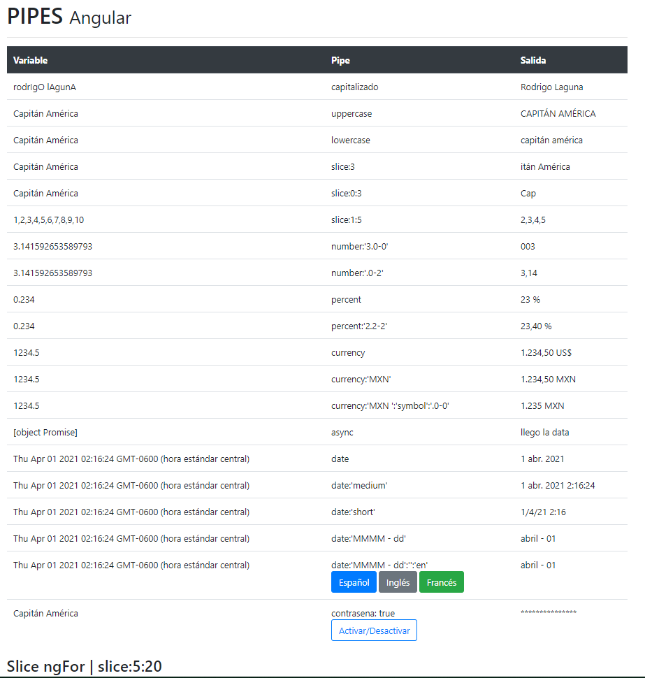

# PIPES

Este proyecto se generó con [Angular CLI] (https://github.com/angular/angular-cli) versión 11.0.6.

## Modulos de Node:
Una vez clonado el proyecto nos movemos al interior de la carpeta del proyecto para descargar las dependencias necesarias.
```
npm install
```
